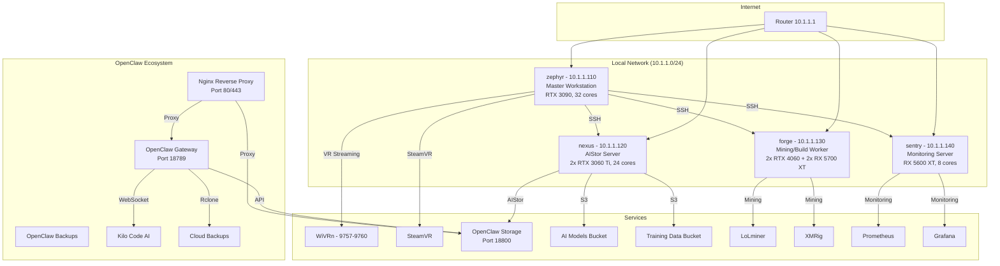

# System Architecture

## Overview
This document describes the architecture of the NixOS distributed build system and cluster configuration.

## Cluster Topology



## Cluster Nodes

| Host | IP Address | Role | CPU Cores | Memory | GPU | Purpose |
|------|------------|------|-----------|--------|-----|---------|
| **zephyr** | 10.1.1.110 | Master Node | 32 | 64GB | RTX 3090 | VR Gaming, Development, Build Coordination |
| **nexus** | 10.1.1.120 | Build/Backup | 24 | 32GB | 2x RTX 3060 Ti | Distributed Builds, AIStor Storage |
| **forge** | 10.1.1.130 | GPU Compute | 6 | 32GB | 2x RTX 4060 + 2x RX 5700 XT | GPU Compute, Mining |
| **sentry** | 10.1.1.140 | Monitoring | 8 | 32GB | RX 5600 XT | Monitoring, Light Builds |

## Service Architecture

### OpenClaw AI Agent Gateway
```
┌─────────────────────────────────────────────────────────────┐
│  OpenClaw Declarative Container                             │
├─────────────────────────────────────────────────────────────┤
│  • Runs in Docker container with systemd management          │
│  • User: lobster (uid: 982, gid: 979) - no sudo access      │
│  • Port: 18789 (localhost only)                             │
│  • Health checks every 30 seconds                           │
│  • Auto-restart on failure                                  │
└─────────────────────────────────────────────────────────────┘
         │
         └───────────────────┐
                             ▼
         ┌─────────────────────────────────────────────────────┐
         │  OpenClaw Storage MCP                               │
         ├─────────────────────────────────────────────────────┤
         │  • S3-compatible API via AIStor                     │
         │  • Port: 18800 (localhost only)                     │
         │  • Manages AI/ML artifacts in AIStor buckets         │
         │  • Integrates with rclone for cloud backups          │
         └─────────────────────────────────────────────────────┘
                             │
                             ▼
         ┌─────────────────────────────────────────────────────┐
         │  Nginx Reverse Proxy                                │
         ├─────────────────────────────────────────────────────┤
         │  • SSL/TLS termination (Let's Encrypt)              │
         │  • Rate limiting (10 req/sec, burst 20)              │
         │  • IP allowlisting for security                     │
         │  • WebSocket support for gateway                     │
         │  • Ports: 80 (HTTP), 443 (HTTPS)                    │
         └─────────────────────────────────────────────────────┘
```

### AIStor Object Storage
```
┌─────────────────────────────────────────────────────────────┐
│  AIStor Server (MinIO)                                       │
├─────────────────────────────────────────────────────────────┤
│  • Single-node deployment on nexus (10.1.1.120:9000)         │
│  • S3-compatible API                                        │
│  • UI: http://10.1.1.120:9001                               │
│  • Buckets:                                                 │
│    - ai-models: Trained models and checkpoints               │
│    - training-data: Datasets and corpora                     │
│    - experiments: ML experiment artifacts                     │
│    - ai-logs: Training logs and metrics                       │
│    - nix-cache: Nix binary cache                              │
└─────────────────────────────────────────────────────────────┘
```

### Mining Services
```
┌─────────────────────────────────────────────────────────────┐
│  Mining Cluster                                             │
├─────────────────────────────────────────────────────────────┤
│  • GPU Mining: lolMiner (NVIDIA)                            │
│  • CPU Mining: XMRig                                       │
│  • API: localhost:34000 (only accessible from localhost)     │
│  • Auto-pause during gaming/VR sessions                      │
│  • Smart mining pause via systemd slices                     │
└─────────────────────────────────────────────────────────────┘
```

## Workload Isolation

### Systemd Slices
```
┌─────────────────────────────────────────────────────────────┐
│  system.slice                                               │
├─────────────────────────────────────────────────────────────┤
│  ├─ nix-build.slice (Priority: high)                        │
│  │  └─ Distributed build processes                         │
│  ├─ gaming.slice (Priority: high)                          │
│  │  └─ SteamVR, WiVRn, VR applications                      │
│  ├─ mining.slice (Priority: low)                           │
│  │  └─ lolminer, xmrig                                     │
│  └─ user.slice                                              │
│     └─ User applications and services                        │
└─────────────────────────────────────────────────────────────┘
```

## Configuration Management

### Flake Structure
```
/etc/nixos/
├── flake.nix                 # Main flake with Colmena hosts
├── configuration.nix        # Shared configuration (~365 lines)
├── home.nix                 # Home Manager user configuration
├── network.nix              # Network and deployment settings
├── justfile                 # Automation and management commands
├── colmena.nix              # Distributed build cluster config
├── hosts/                   # Host-specific configurations
│   ├── zephyr/              # Master workstation
│   ├── nexus/               # Build/backup server
│   ├── forge/               # Build/Development server
│   └── sentry/              # Monitoring server
├── modules/                 # Shared configuration modules (25+ files)
│   ├── openclaw-declarative-container.nix  # Primary OpenClaw implementation
│   ├── openclaw-overlay.nix  # Dependency fix overlay
│   ├── openclaw-common.nix  # Shared OpenClaw configuration
│   ├── openclaw-storage.nix # AIStor S3 MCP
│   ├── openclaw-backups.nix # Cloud backup automation
│   ├── openclaw-nginx.nix   # Reverse proxy with SSL
│   ├── mining.nix           # Mining services
│   ├── gaming.nix           # VR/Gaming setup
│   └── ...                  # Other modules
├── secrets/                 # Agenix encrypted secrets
└── scripts/                 # Automation scripts
    ├── setup/               # Initial setup scripts
    ├── maintenance/         # Maintenance and cleanup scripts
    ├── monitoring/          # Performance and status scripts
    └── testing/             # Testing and validation scripts
```

## Security Architecture

### Service User Isolation
```
User: lobster (uid: 982, gid: 979)
├─ System user (no login shell)
├─ Home: /var/lib/lobster
├─ Groups: lobster, rclone
├─ Permissions: No sudo access, no wheel group
├─ Purpose: OpenClaw bot operations
└─ Services: openclaw-container-declarative, openclaw-storage, openclaw-backups
```

### Systemd Hardening
```nix
systemd.services.openclaw-container-declarative.serviceConfig = {
  NoNewPrivileges = true;
  ProtectSystem = "strict";
  ProtectHome = true;
  PrivateTmp = true;
  ReadWritePaths = ["/var/lib/openclaw"];
};
```

### Network Security
```
Inbound Rules:
├─ Port 22 (SSH) - Allowed from trusted networks
├─ Port 80/443 (Nginx) - Allowed from all
├─ Port 9757-9760 (VR Streaming) - Allowed from local network
└─ All other ports - Blocked

Outbound Rules:
├─ All services - Outbound connections allowed
└─ Mining API - Blocked from external access (localhost only)
```

## Container Isolation
```
OpenClaw Container Security:
├─ --network host (for performance, localhost-only service)
├─ --user "982:979" (runs as lobster user)
├─ --cap-drop ALL (removes all capabilities)
├─ --security-opt "no-new-privileges=true" (prevents privilege escalation)
├─ Health checks every 30 seconds
├─ Auto-restart on unhealthy state
└─ Managed by systemd
```

## Storage Architecture

### AIStor (MinIO) Deployment
```
┌─────────────────────────────────────────────────────────────┐
│  AIStor Server                                              │
├─────────────────────────────────────────────────────────────┤
│  • Storage: Local SSDs on nexus                             │
│  • API: http://10.1.1.120:9000                              │
│  • Console: http://10.1.1.120:9001                          │
│  • User: lobster (service account)                          │
│  • Buckets:                                                 │
│    ├─ ai-models (Trained models)                            │
│    ├─ training-data (Datasets)                              │
│    ├─ experiments (Artifacts)                               │
│    ├─ ai-logs (Training logs)                               │
│    └─ nix-cache (Nix binary cache)                           │
└─────────────────────────────────────────────────────────────┘
```

### Backup Strategy
```
┌─────────────────────────────────────────────────────────────┐
│  Local Backup (AIStor)                                      │
├─────────────────────────────────────────────────────────────┤
│  • Daily snapshots of all buckets                            │
│  • Retention: 30 days                                        │
│  └──────────────────────────────────────────────────────┐
│                                                         ▼
│  ┌─────────────────────────────────────────────────────┐
│  │  Cloud Backup (rclone)                               │
│  ├─────────────────────────────────────────────────────┤
│  │  • Syncs to Google Drive                               │
│  │  • Encrypted with rclone crypt                          │
│  │  • Retention: 90 days                                  │
│  └─────────────────────────────────────────────────────┘
```

## Development Environment

### Direnv + Nix Development Shell
```
Development Shell includes:
├─ Nix tools: nixfmt, alejandra, deadnix, statix
├─ Build tools: just, colmena
├─ Secret management: age, sops
├─ AIStor tools: minio-client
├─ System utilities: jq, curl, git
└─ Language support: Python, JavaScript, Rust

Auto-activated when entering repository:
cd /etc/nixos → direnv allow
```

## CI/CD Pipeline

### Garnix CI/CD
```
Push to GitHub → Garnix builds all flake outputs → Caches at cache.garnix.io
├─ Builds: nixosConfigurations.zephyr/nexus/forge/sentry
├─ Packages: openclaw-gateway, kimi-code
├─ Colmena: Cluster deployment configs
└─ Custom overlays: OpenClaw dependency fixes
```

---

## Key Design Decisions

### OpenClaw Implementation
**Decision**: Use declarative containers instead of binary packages  
**Rationale**:
- Better isolation and security
- Consistent deployment across all hosts
- Easier dependency management
- Docker container provides predictable environment

### Service Binding Policy
**Decision**: Bind all services to localhost by default  
**Rationale**:
- Prevents accidental exposure
- Requires explicit Nginx proxy for external access
- Minimizes attack surface
- Easier firewall configuration

### User Isolation
**Decision**: Run OpenClaw as dedicated lobster user with no sudo  
**Rationale**:
- Limits damage from compromised service
- Prevents privilege escalation
- Follows principle of least privilege

### Storage Choice
**Decision**: AIStor (MinIO) for object storage  
**Rationale**:
- S3-compatible API
- Easy to integrate with AI/ML frameworks
- Free single-node license
- Good performance for training data

### Networking
**Decision**: Local network only for internal services  
**Rationale**:
- All services communicate over 10.1.1.0/24
- External access only via Nginx reverse proxy
- Prevents direct access to sensitive services