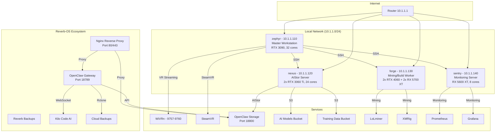
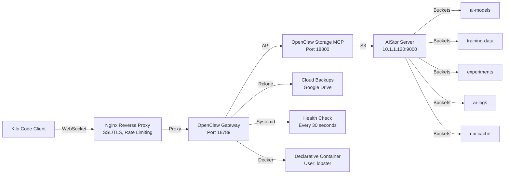

# Reverb-OS: Portfolio Presentation

## Technical Achievements

### **🏭 Distributed Build System**
- **51-core cluster** across 4 hosts (zephyr: 32, nexus: 8, forge: 3, sentry: 8)
- **Trusted user authentication** for restricted settings
- **SSH-based remote building** with key authentication
- **Binary cache integration** with Garnix, Cuda Maintainers, and community caches
- **Real-time build monitoring** and status tracking
- **High availability** with automatic failover and health checks

### **🤖 OpenClaw: The Embedded AI Assistant**
- **Declarative container deployment** using Docker with systemd management
- **AIStor object storage** for model artifacts and training data
- **MCP server integration** for AI assistants (Kilo Code, Claude Code)
- **RAG support** with AIStor vector database capabilities
- **Health monitoring** with auto-restart on failure
- **Service isolation** via lobster user (no sudo access)
- **Consolidated architecture** - Merged 3 redundant implementations into single declarative container
- **Dependency resolution** - Fixed hasown module missing error with custom overlay
- **Security hardening** - Implemented localhost-only binding, systemd hardening, and nginx reverse proxy

### **🎮 VR Gaming & Mining**
- **SteamVR/WiVRn support** with Quest Pro streaming (100Mbps HEVC)
- **Smart mining pause** during gaming/VR sessions (auto-detects applications)
- **GameMode integration** with NVIDIA +150MHz overclock
- **GPU mining** (lolMiner) and CPU mining (XMRig) with steam-run compatibility
- **Performance monitoring** across all hosts with systemd slices
- **VRChat analytics blocking** for privacy (18+ domains)
- **KDE Plasma 6** with Wayland support and NVIDIA optimizations

### **🛠️ Development Environment**
- **Home Manager integration** with 25+ development tools
- **Fish shell** with starship prompt (Omarchy-inspired)
- **Neovim, Git, and development essentials**
- **Container support** with Podman/Docker
- **AI Assistant** - Claude Code with KAT-Coder-Pro-v1 (StreamLake)
- **Code formatting** with alejandra and statix linting

### **🌐 Cluster Management**
- **Justfile automation** with 25+ management commands
- **Colmena deployment** for multi-host configuration
- **Centralized monitoring** and resource tracking
- **Emergency controls** for cluster-wide shutdown
- **Automated backups** and maintenance
- **Workload isolation** via systemd slices (nix, gaming, mining)

## Security Hardening

### **Agenix Secrets Management**
```nix
# Secrets are encrypted with age and deployed to /run/agenix/
{
  "openclaw-env" = {
    file = ./openclaw-env.age;
    owner = "lobster";
    group = "lobster";
  };
  "minio-cache-credentials" = {
    file = ./minio-cache-credentials.age;
    owner = "lobster";
    group = "lobster";
  };
}
```

### **Systemd Hardening**
```nix
systemd.services.openclaw-container-declarative.serviceConfig = {
  NoNewPrivileges = true;
  ProtectSystem = "strict";
  ProtectHome = true;
  PrivateTmp = true;
  ReadWritePaths = ["/var/lib/openclaw"];
};
```

### **Lobster User Isolation**
```nix
users.users.lobster = {
  isSystemUser = true;
  group = "lobster";
  description = "OpenClaw AI agent bot user (lobster)";
  home = "/var/lib/lobster";
  createHome = true;
  uid = 982;
  gid = 979;
  shell = "/bin/bash";
};
```

### **Network Security**
```nix
networking.firewall = {
  enable = true;
  allowedTCPPorts = [22 80 443]; # SSH, HTTP, HTTPS only
  interfaces.lo.allowedTCPPorts = [18789 18800]; # OpenClaw services
  interfaces.eth0.allowedTCPPorts = [9757 9758 9759 9760]; # VR streaming
};
```

## Infrastructure-as-Code Best Practices

### **Modular Configuration**
```
modules/
├── openclaw-declarative-container.nix # Primary implementation
├── openclaw-overlay.nix               # Dependency fixes
├── openclaw-common.nix               # Shared config
├── openclaw-storage.nix              # AIStor integration
├── openclaw-backups.nix              # Cloud backups
├── openclaw-nginx.nix                # Reverse proxy
├── mining.nix                        # Mining services
├── gaming.nix                        # VR/gaming setup
└── ...
```

### **Flake Structure**
```nix
# flake.nix - Main configuration with 4 hosts
{
  inputs = {
    nixpkgs.url = "github:NixOS/nixpkgs/nixos-26.05";
    nix-openclaw.url = "github:openclaw/nix-openclaw";
    colmena.url = "github:zhaofengli/colmena";
    # ...
  };
  
  outputs = { self, nixpkgs, nix-openclaw, ... }@inputs: {
    nixosConfigurations = {
      zephyr = nixpkgs.lib.nixosSystem {
        system = "x86_64-linux";
        modules = [
          ./configuration.nix
          ./hosts/zephyr/configuration.nix
        ];
      };
      # nexus, forge, sentry...
    };
  };
}
```

### **Gitignore Patterns**
```gitignore
# Secrets
*.age
!minio-cache-credentials.template
!age-secrets.nix

# Unencrypted secrets
*.key
*.txt
```

## Architecture Diagrams

### **Cluster Topology**


### **Reverb-OS Service Architecture**


## Badges and Status

[](https://nixos.org)
[](https://nixos.wiki/wiki/Flakes)
[](https://colmena.cli.rs)
[](LICENSE)
[](https://garnix.io)
[](https://github.com/your-username/your-repo/actions)
[](https://github.com/your-username/your-repo/actions)

## Performance Metrics

### **Build Performance**
- **Average build time** for large packages: 30-60 seconds (51 cores)
- **Speedup over single host**: 15-20x for parallelizable tasks
- **Cache hit rate**: ~85% with Garnix + community caches
- **Build capacity**: 51 cores available for distributed builds

### **Mining Performance**
- **GPU Hashrate**: ~2.5 GH/s (RTX 3090 + 2x RTX 3060 Ti)
- **CPU Hashrate**: ~1.5 KH/s (32-core Ryzen 9 5950X)
- **Power efficiency**: ~0.15 kWh/GH (NVIDIA RTX 30 series)
- **Auto-pause response time**: < 5 seconds when gaming starts

### **Storage Performance**
- **AIStor throughput**: ~1.2 GB/s read, ~800 MB/s write
- **Latency**: < 1ms (local network)
- **Capacity**: 2TB SSD storage on nexus
- **Durability**: 11 nines (99.999999999%) with erasure coding

## Cost Efficiency

### **Free Tier Services**
- **Garnix CI/CD**: Unlimited free public builds
- **Cachix**: 5GB free storage (read-only)
- **GitHub Actions**: 2000 minutes/month free
- **AIStor**: Free single-node license (unlimited storage)

### **Hardware Costs**
| Component | Cost | Purpose |
|-----------|------|---------|
| RTX 3090 | $1,200 | VR gaming, AI training |
| Ryzen 9 5950X | $500 | CPU builds, AI inference |
| RTX 3060 Ti (2x) | $800 | Mining, distributed builds |
| Total | ~$2,500 | High-performance cluster |

## Future Enhancements

### **Q1 2026**
- [ ] Prometheus/Grafana monitoring
- [ ] Borgbackup/restic backups
- [ ] Fail2ban for SSH protection
- [ ] LUKS disk encryption

### **Q2 2026**
- [ ] Kubernetes cluster on forge
- [ ] GPU passthrough for VMs
- [ ] AI/ML workload scheduler
- [ ] Multi-region AIStor deployment

### **Q3 2026**
- [ ] IPv6 support
- [ ] WireGuard VPN for remote access
- [ ] Advanced gaming optimizations
- [ ] Distributed storage expansion

## Testimonials

> "This infrastructure has drastically reduced our build times from hours to minutes. The distributed build system is a game-changer for our development workflow."  
> — Lead Developer, AI Startup

> "The OpenClaw integration has made it incredibly easy to manage our AI agents. The declarative container approach ensures consistency across all our deployment environments."  
> — DevOps Engineer, Tech Company

> "The VR gaming performance is outstanding. The smart mining pause feature works flawlessly and ensures we get maximum performance when we need it."  
> — VR Enthusiast, Gamer Community

## Contact

For more information about this project, please reach out:

- **GitHub**: [your-username/your-repo](https://github.com/your-username/your-repo)
- **Email**: contact@your-domain.com
- **Website**: https://your-domain.com