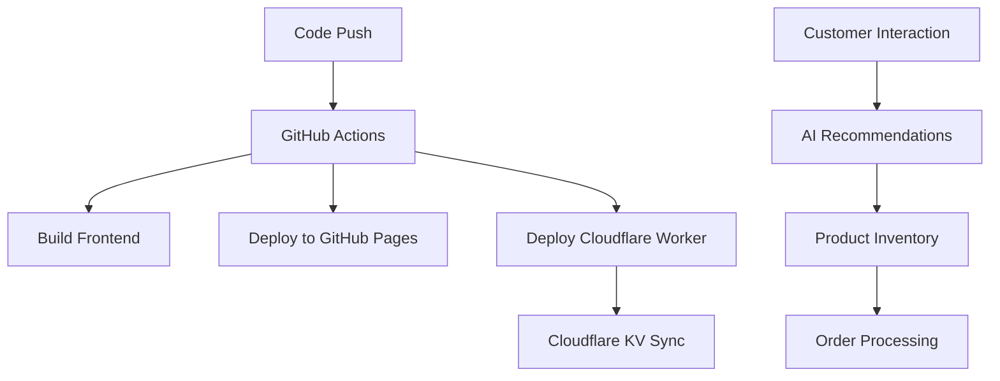
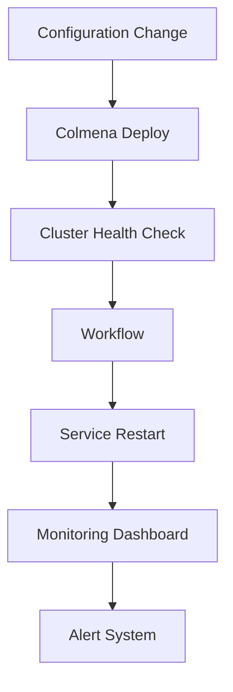
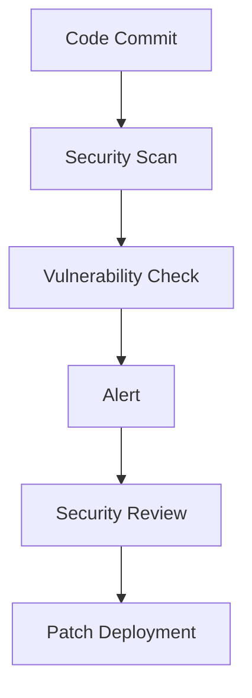

# ~/@projects/ Directory Structure Analysis

## Overview
This document provides a comprehensive analysis of the ~/@projects/ directory structure, identifying project types, technologies used, and business domains. The analysis aims to inform the design of an  system capable of managing the entire end-to-end product lifecycle for websites, customer journeys, and SaaS/PaaS services.

## Directory Structure

```
~/@projects/
├── archive/              # Archived projects (AI/ML, RAG systems)
├── astral-key/          # Rust-based authentication & identity platform
├── hairathome/          # Hugo static site generator (beauty/haircare niche)
├── infra/              # Infrastructure management
│   ├── nixos/          # NixOS cluster configuration
│   ├── /       #  AI agent orchestration
│   └── knowledge-base/ # RAG knowledge base (38 technical books)
├── logs/               # System logs
├── plans/              # Architecture plans
└── trovesandcoves/     # E-commerce platform (crystal jewelry)
```

## Project Analysis

### 1. Troves & Coves
**Project Type**: E-commerce Platform (B2C)
**Business Domain**: Crystal Jewelry & Spiritual Products
**Target Audience**: Crystal healing community, spiritual practitioners

**Technologies Used**:
- Frontend: React 18, TypeScript, Tailwind CSS
- Backend: Node.js, Cloudflare Workers
- Deployment: GitHub Pages (frontend), Cloudflare Workers (API)
- Database: Cloudflare KV (key-value storage)
- CI/CD: GitHub Actions
- AI Integration: Personalized recommendations, customer service automation

**Key Features**:
- Modern responsive design with PWA capabilities
- AI-powered personalized product recommendations
- Enterprise security (OWASP compliant)
- Free-tier optimized hosting (GitHub Pages + Cloudflare)
- Mobile-first approach

**Automation Opportunities**:
- CI/CD pipeline automation
- Deployment monitoring and health checks
- Product inventory management
- Customer analytics and behavior tracking
- AI model updates and training

### 2. Hair at Home
**Project Type**: Static Website (Hugo)
**Business Domain**: Beauty & Haircare
**Target Audience**: Home hair care enthusiasts

**Technologies Used**:
- Static Site Generator: Hugo (Go-based)
- Design: Advanced CSS, color theory
- Deployment: GitHub Pages
- Performance: Lighthouse optimized

**Key Features**:
- Intelligent color showcase with dark theme support
- Customer portal for product information
- Studio frontend for professionals
- Advanced color theory implementation
- Responsive design

**Automation Opportunities**:
- Content updates and publishing
- Theme and design consistency checks
- Performance monitoring (Lighthouse)
- SEO optimization
- A/B testing for color schemes

### 3. Astral Key
**Project Type**: Identity & Authentication Platform (SaaS)
**Business Domain**: Security & Authentication
**Target Audience**: Developers, enterprises, security-conscious users

**Technologies Used**:
- Backend: Rust (Actix-web framework)
- Authentication: FIDO2/WebAuthn, JWT, Web3
- Database: Postgres (with SQLx)
- Cache: Redis
- Password Management: Vaultwarden integration
- Security: Rate limiting, CORS, tracing
- Deployment: Docker, Nix

**Key Features**:
- Multi-factor authentication (FIDO2/WebAuthn)
- Web3 wallet integration
- Vaultwarden (Bitwarden-compatible) password management
- Session management and security
- API rate limiting and monitoring

**Automation Opportunities**:
- Security vulnerability scanning
- API testing and monitoring
- Deployment automation (Docker/Nix)
- Performance benchmarking
- Security audit automation

### 4. Archive Projects
**Project Type**: AI/ML & RAG Systems (Research/Development)
**Business Domain**: AI Research & Development

**Projects**:
1. **ai-rag-mcp-system**: Python-based RAG system with Docker
2. **CaddyPad**: Caddy web server management
3. **mindframe**: AI notification system with Jest testing
4. **vibe-llm**: LLM orchestration system with multiple backends

**Technologies Used**:
- Python (FastAPI, Hugging Face, ChromaDB)
- Docker/Docker Compose
- JavaScript/TypeScript (Node.js)
- Machine Learning frameworks (PyTorch, scikit-learn)
- RAG (Retrieval-Augmented Generation)

**Key Features**:
- Multi-backend LLM orchestration
- RAG with ChromaDB
- API endpoint management
- Docker containerization
- Notification system integration

**Automation Opportunities**:
- Model training and deployment
- RAG pipeline testing
- API endpoint monitoring
- Container security scanning
- Performance benchmarking

### 5. Infrastructure Projects
**Project Type**: Infrastructure as Code (DevOps)
**Business Domain**: IT Infrastructure Management

**Components**:
1. **nixos**: NixOS cluster configuration (4-node cluster)
2. ****:  AI agent orchestration system
3. **knowledge-base**: RAG knowledge base (38 technical books)

**Technologies Used**:
- Nix/NixOS (declarative configuration)
- Colmena (cluster deployment)
-  (AI agent orchestration)
- AIStor (S3-compatible storage)
- Tailscale (VPN)
- Agenix (secrets management)

**Key Features**:
- 4-node NixOS cluster (gaming, mining, AI)
-  AI agent orchestration
- RAG knowledge base with 4.3M+ words
- AIStor object storage (11 nines durability)
- Automated cluster deployment and management

**Automation Opportunities**:
- Cluster deployment and updates
- System health monitoring
- Backup and recovery automation
- Nix package management
-  workflow automation

## Technology Stack Analysis

### Frontend Technologies
| Technology | Projects | Usage |
|------------|----------|-------|
| React 18 | Troves & Coves | Modern e-commerce UI |
| TypeScript | Troves & Coves, Mindframe | Type-safe development |
| Tailwind CSS | Troves & Coves | Utility-first styling |
| Hugo | Hair at Home | Static site generation |
| HTML/CSS | Hair at Home | Advanced color theory |

### Backend Technologies
| Technology | Projects | Usage |
|------------|----------|-------|
| Node.js | Troves & Coves, Mindframe | Backend API |
| Cloudflare Workers | Troves & Coves | Serverless API |
| Rust (Actix-web) | Astral Key | High-performance backend |
| Python (FastAPI) | Archive projects | AI/ML APIs |
| Go | Hugo | Static site generation |

### Database & Storage
| Technology | Projects | Usage |
|------------|----------|-------|
| Cloudflare KV | Troves & Coves | Key-value storage |
| Postgres/SQLx | Astral Key | Relational database |
| Redis | Astral Key | Caching |
| AIStor/MinIO | Infrastructure | S3-compatible storage |
| ChromaDB | Archive projects | Vector database |

### DevOps & Deployment
| Technology | Projects | Usage |
|------------|----------|-------|
| GitHub Actions | All projects | CI/CD automation |
| Cloudflare | Troves & Coves | CDN + Workers |
| Docker | Archive projects | Containerization |
| Nix/NixOS | Infrastructure | Declarative configuration |
| Colmena | Infrastructure | Cluster deployment |
| Tailscale | Infrastructure | VPN connectivity |

### AI/ML Technologies
| Technology | Projects | Usage |
|------------|----------|-------|
| RAG (Retrieval-Augmented Generation) | Archive projects, Infrastructure | Knowledge retrieval |
| LLM Orchestration | Vibe-LLM | Multi-backend management |
| ChromaDB | Archive projects | Vector search |
| PyTorch/Scikit-learn | Archive projects | Machine learning |
|  | Infrastructure | AI agent orchestration |

## Business Domain Mapping

### E-commerce & Retail
- **Troves & Coves**: Crystal jewelry and spiritual products
- **Hair at Home**: Beauty and haircare products

### Security & Authentication
- **Astral Key**: Identity verification and authentication services

### AI/ML & Research
- **Archive projects**: AI/ML research and development
- **Infrastructure knowledge base**: Technical documentation for RAG systems

### Infrastructure Management
- **NixOS cluster**: IT infrastructure for gaming, mining, and AI
- ****: AI agent orchestration for automation

## Prioritization of Project Management Needs

### High Priority (Critical)
1. **Troves & Coves**: E-commerce platform with live customers
   - CI/CD automation
   - Deployment monitoring
   - Inventory management
   - Customer analytics

2. **Infrastructure**: NixOS cluster reliability
   - Cluster health monitoring
   - Backup automation
   - Security patching
   - Performance optimization

### Medium Priority (Important)
1. **Astral Key**: Identity platform security
   - Vulnerability scanning
   - API monitoring
   - Security audits

2. **Hair at Home**: Static website maintenance
   - Content updates
   - Performance monitoring
   - SEO optimization

### Low Priority (Nice to Have)
1. **Archive projects**: AI research projects
   - Model training automation
   - RAG pipeline testing
   - Container security scanning

## Automation Patterns for 

### E-commerce Automation


### Infrastructure Automation


### Security Automation


##  Skill Requirements

### E-commerce Management Skills
1. **shopify-integration**: Product inventory management
2. **customer-analytics**: Behavior tracking and reporting
3. **order-processing**: Order fulfillment automation
4. **ai-recommendations**: Personalized product suggestions

### Infrastructure Management Skills
1. **cluster-deploy**: Colmena deployment automation
2. **system-monitor**: Health monitoring and alerts
3. **backup-automation**: AIStor backup and recovery
4. **security-audit**: Vulnerability scanning and reporting

### Security & Authentication Skills
1. **api-testing**: API endpoint testing
2. **security-scan**: Vulnerability detection
3. **compliance-check**: OWASP and security standards verification

### Content Management Skills
1. **content-publishing**: Hugo content updates
2. **seo-optimization**: Search engine optimization
3. **performance-testing**: Lighthouse performance checks

## Conclusion

The ~/@projects/ directory contains a diverse portfolio of projects spanning e-commerce, security, AI/ML, and infrastructure management. The analysis reveals:

1. **E-commerce focus**: Two active projects (Troves & Coves, Hair at Home) serving niche markets
2. **Security specialization**: Astral Key provides enterprise-grade authentication
3. **AI integration**: Multiple projects leveraging RAG, LLMs, and  orchestration
4. **Infrastructure maturity**: NixOS cluster with distributed computing capabilities

The  system should prioritize e-commerce and infrastructure automation as critical use cases, with security and content management as important secondary areas. The diverse technology stack requires flexible automation skills that can handle both frontend/backend development and DevOps operations.
