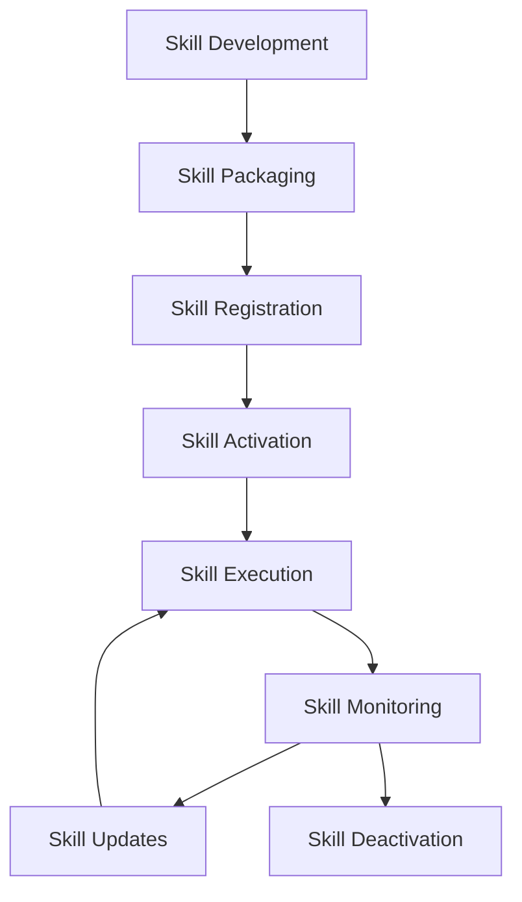
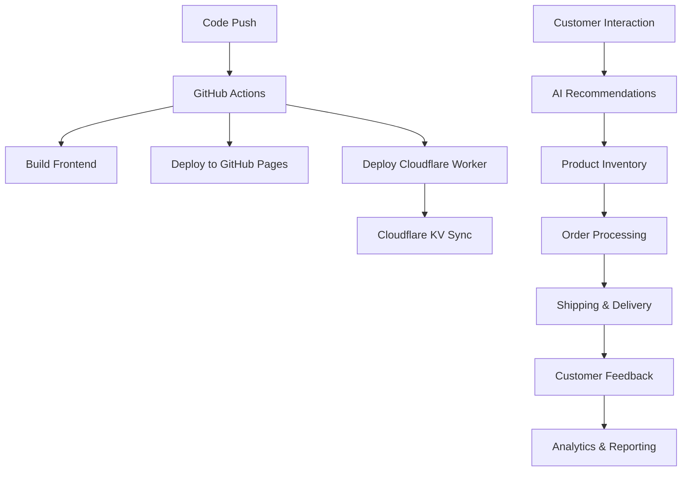
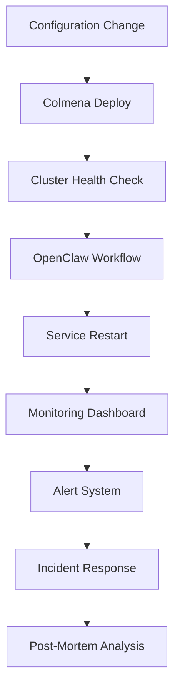
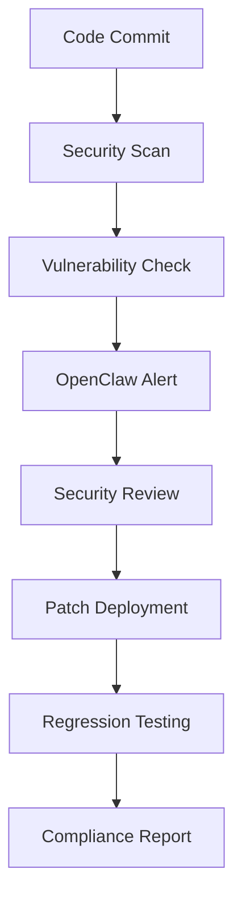
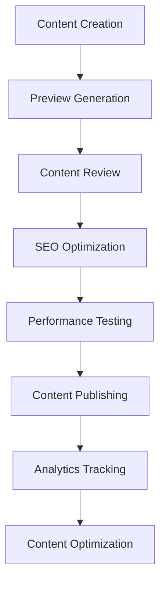
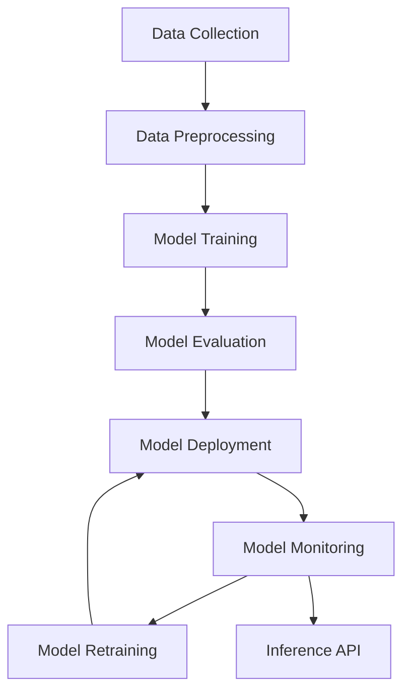
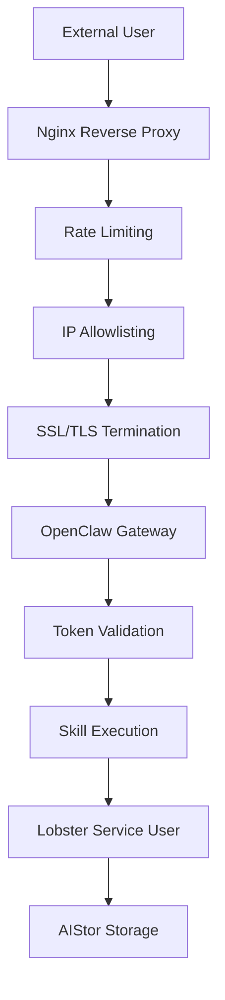
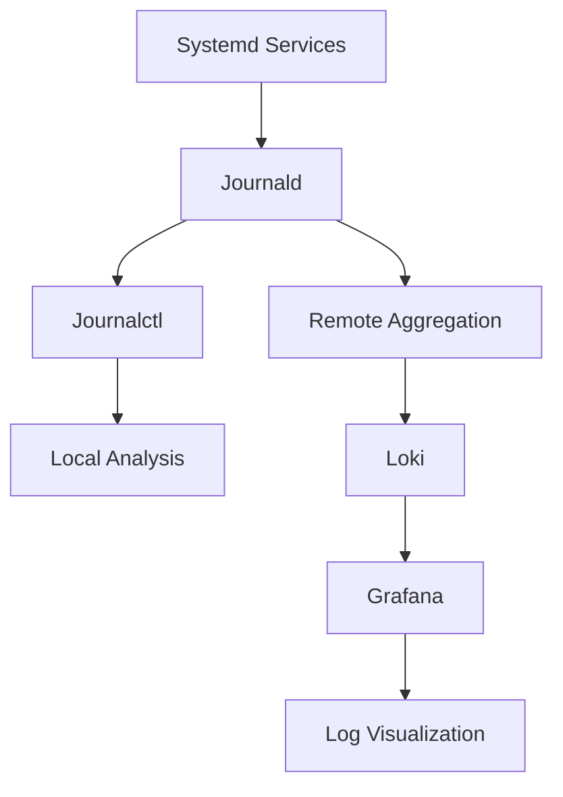
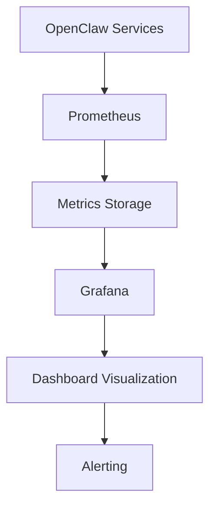

# OpenClaw System Architecture

## Overview

OpenClaw is an AI agent orchestration system designed to manage the entire end-to-end product lifecycle for websites, customer journeys, and SaaS/PaaS services. This architecture provides a robust, extensible framework for handling diverse project types including e-commerce platforms, static websites, identity platforms, AI/ML systems, and infrastructure management.

## Architectural Principles

1. **Security-First Design**: Services run in isolated environments with minimal privileges
2. **Extensibility**: Modular component design with pluggable skills ecosystem
3. **Scalability**: Horizontal scaling via containerization and distributed workflows
4. **Reliability**: Health monitoring, auto-recovery, and fault tolerance
5. **Observability**: Comprehensive logging, metrics, and traceability
6. **Automation**: Declarative configuration and workflow automation patterns

## System Components

### 1. OpenClaw Gateway

**Purpose**: Core AI agent orchestration and workflow management

**Features**:
- WebSocket gateway for real-time agent communication
- REST API for management operations
- Skill lifecycle management
- Workflow engine for automation
- Authentication and authorization

**Technical Specifications**:
- **Protocol**: WebSocket + REST API
- **Port**: 18789 (localhost only)
- **User**: `lobster` (service account, no sudo)
- **Container**: Docker with systemd hardening
- **Health Checks**: 30-second interval with auto-restart

### 2. OpenClaw Storage MCP

**Purpose**: Natural language interface for AIStor object storage

**Features**:
- Natural language commands for storage operations
- Automated training checkpoint workflows
- Dataset ingestion with manifest generation
- Experiment tracking with versioning
- Cloud backup triggers
- Storage statistics and monitoring

**Technical Specifications**:
- **Protocol**: HTTP API + MCP
- **Port**: 18800 (localhost only)
- **Language**: Python/FastAPI
- **Storage**: AIStor/MinIO S3-compatible
- **Backups**: rclone integration (Google Drive, Backblaze B2, Wasabi)

### 3. Nginx Reverse Proxy

**Purpose**: Secure external access with SSL/TLS termination

**Features**:
- SSL/TLS termination (Let's Encrypt support)
- Rate limiting (10 req/sec, burst 20)
- IP allowlisting for security
- WebSocket support
- Security headers (X-Frame-Options, X-Content-Type-Options, etc.)

**Endpoints**:
- `/gateway` - WebSocket gateway (proxies to localhost:18789)
- `/storage` - Storage MCP API (proxies to localhost:18800)
- `/health` - Health check endpoint

**Security**:
- External access only via nginx (ports 80/443)
- OpenClaw services bind to localhost only

### 4. AIStor Object Storage

**Purpose**: S3-compatible object storage for AI/ML workloads

**Features**:
- 5 AI-optimized buckets:
  - `ai-models` - Model checkpoints with versioning
  - `training-data` - Datasets with metadata
  - `experiments` - Experiment artifacts and reports
  - `ai-logs` - Training logs and metrics
  - `nix-cache` - Binary cache for faster builds

**Technical Specifications**:
- **Endpoint**: `http://192.168.100.X:9000` (internal network only)
- **Console**: `http://192.168.100.X:9001`
- **Data Durability**: 11 nines (99.999999999%)
- **Redundancy**: Erasure coding for fault tolerance

### 5. Lobster Service User

**Purpose**: Isolated service account for OpenClaw operations

**Security Hardening**:
- `isSystemUser = true` (not a login user)
- No sudo access
- No wheel group membership
- No docker group (prevents container escape)
- Home: `/var/lib/lobster`
- Shell: `/bin/bash` (non-interactive)
- UID/GID: 982/979

### 6. Systemd Hardening

**Purpose**: Enhanced security for OpenClaw services

**Key Hardening Features**:
```
NoNewPrivileges = true;
PrivateTmp = true;
ProtectSystem = "strict";
ProtectHome = true;
ReadWritePaths = ["/var/lib/openclaw"];
```

## Skill Ecosystem Design

### Skill Architecture

Skills are modular capabilities that extend OpenClaw's functionality. Each skill implements specific automation patterns for different project types.

### Skill Categories

#### E-commerce Management Skills

| Skill Name | Description | Project Type |
|------------|-------------|--------------|
| `shopify-integration` | Product inventory management | E-commerce |
| `customer-analytics` | Behavior tracking and reporting | E-commerce |
| `order-processing` | Order fulfillment automation | E-commerce |
| `ai-recommendations` | Personalized product suggestions | E-commerce |

#### Infrastructure Management Skills

| Skill Name | Description | Project Type |
|------------|-------------|--------------|
| `cluster-deploy` | Colmena deployment automation | Infrastructure |
| `system-monitor` | Health monitoring and alerts | Infrastructure |
| `backup-automation` | AIStor backup and recovery | Infrastructure |
| `security-audit` | Vulnerability scanning and reporting | Infrastructure |

#### Security & Authentication Skills

| Skill Name | Description | Project Type |
|------------|-------------|--------------|
| `api-testing` | API endpoint testing | Security |
| `security-scan` | Vulnerability detection | Security |
| `compliance-check` | OWASP and security standards verification | Security |

#### Content Management Skills

| Skill Name | Description | Project Type |
|------------|-------------|--------------|
| `content-publishing` | Hugo content updates | Static Sites |
| `seo-optimization` | Search engine optimization | Static Sites |
| `performance-testing` | Lighthouse performance checks | Static Sites |

#### AI/ML Skills

| Skill Name | Description | Project Type |
|------------|-------------|--------------|
| `model-training` | ML model training automation | AI/ML |
| `rag-pipeline` | Retrieval-Augmented Generation workflows | AI/ML |
| `api-endpoint` | API endpoint management | AI/ML |
| `container-security` | Container security scanning | AI/ML |

### Skill Lifecycle Management



## Workflow Automation Patterns

### 1. E-commerce Automation Workflow



### 2. Infrastructure Automation Workflow



### 3. Security Automation Workflow



### 4. Content Management Workflow



### 5. AI/ML Workflow



## Integration Points with External Systems

### GitHub Integration

**Purpose**: CI/CD automation and source control

**Integration Points**:
- GitHub Actions for workflow automation
- GitHub Pages for static site deployment
- GitHub API for repository management
- Webhook integration for event triggers

### Cloudflare Integration

**Purpose**: CDN, serverless, and edge computing

**Integration Points**:
- Cloudflare Workers for API endpoints
- Cloudflare KV for key-value storage
- Cloudflare CDN for content delivery
- Cloudflare Analytics for performance monitoring

### AI Provider Integration

**Purpose**: LLM and AI service integration

**Supported Providers**:
- Anthropic (Claude API)
- OpenAI (GPT-4 API)
- Local LLMs via Ollama
- Custom RAG systems

### Cloud Storage Integration

**Purpose**: Data backup and archival

**Supported Providers**:
- Google Drive (15GB free tier)
- Backblaze B2 ($0.005/GB/month)
- Wasabi ($6.99/TB/month)
- AWS S3
- Azure Blob Storage
- Dropbox

### Monitoring & Alerting

**Purpose**: System health and performance monitoring

**Integration Points**:
- Prometheus for metrics collection
- Grafana for visualization
- Alertmanager for alerting
- Loki for log aggregation
- Node exporter for system metrics

## Security and Authentication Mechanisms

### Authentication Architecture



### Authentication Methods

1. **Token-Based Authentication**:
   - `OPENCLAW_GATEWAY_TOKEN` for API access
   - Stored in `/run/agenix/openclaw-gateway-token` (encrypted)
   - Required for all API and WebSocket connections

2. **IP Allowlisting**:
   - Nginx restricts access to specific IP ranges
   - Default: localhost and internal network
   - Production: Restrict to trusted IP addresses

3. **Security Headers**:
   - X-Frame-Options: DENY
   - X-Content-Type-Options: nosniff
   - X-XSS-Protection: 1; mode=block
   - Referrer-Policy: strict-origin-when-cross-origin
   - Content-Security-Policy: default-src 'self'

### Rate Limiting

```nginx
# Rate limit configuration
limit_req_zone $binary_remote_addr zone=mcp:10m rate=10r/s;
limit_req zone=mcp burst=20 nodelay;
```

### Secrets Management

**Agenix Encryption**:
- All secrets stored in `secrets/` directory
- Encrypted using age encryption
- Decrypted at runtime to `/run/agenix/`
- Access controlled via ACLs

**Required Secrets**:
- `openclaw-env` - OpenClaw gateway environment
- `openclaw-gateway-token` - API authentication token
- `minio-cache-credentials` - AIStor S3 access
- `anthropic-api-key` - Claude API key
- `openai-api-key` - OpenAI API key

## Monitoring and Logging Infrastructure

### Health Monitoring

**Systemd Timers**:
- `openclaw-health.timer` - 30-second health checks
- `openclaw-storage-health.timer` - 30-second storage service checks
- Auto-restart on 3 consecutive failures

**Health Check Endpoints**:
- `http://127.0.0.1:18789/health` - Gateway health
- `http://127.0.0.1:18800/health` - Storage MCP health
- `http://openclaw.local/health` - External health check

### Logging Architecture



### Metrics Collection



### Key Metrics

**Gateway Metrics**:
- `openclaw_gateway_connections` - Active WebSocket connections
- `openclaw_gateway_requests` - API request count
- `openclaw_gateway_errors` - Error rate
- `openclaw_gateway_skills_active` - Active skills count

**Storage Metrics**:
- `openclaw_storage_requests` - Storage operations
- `openclaw_storage_bytes_transferred` - Data transfer volume
- `openclaw_storage_errors` - Storage errors
- `openclaw_storage_backup_status` - Backup status

**System Metrics**:
- `system_cpu_usage` - CPU utilization
- `system_memory_usage` - Memory consumption
- `system_disk_usage` - Disk space
- `system_network_traffic` - Network activity

## Scalability and Reliability

### Horizontal Scaling

**Container Orchestration**:
- Docker containers for isolation
- Kubernetes integration (future)
- Load balancing via nginx
- Auto-scaling based on metrics

### Fault Tolerance

**Health Monitoring**:
- 30-second health checks
- Auto-restart on failure
- Failed container detection
- Service health dashboard

### Data Resilience

**AIStor Redundancy**:
- Erasure coding for data protection
- Bucket lifecycle policies
- Object versioning
- Cloud backup synchronization

### Disaster Recovery

**Rclone Backup Strategy**:
- Automated daily backups
- Incremental backup support
- Cloud storage replication
- Disaster recovery testing

## Deployment Architecture

### Current Cluster Configuration

```
┌──────────────────────────────────────────────────────────────────────┐
│                         NixOS Cluster (4 Nodes)                       │
│ ┌──────────────────────────────────────────────────────────────┐    │
│ │                    ZEPHYR (192.168.100.X)                         │    │
│ │  ┌─────────────────┐  ┌──────────────────┐  ┌─────────────┐   │    │
│ │  │ OpenClaw Gateway │  │ OpenClaw Storage │  │ Nginx Proxy │   │    │
│ │  │ 127.0.0.1:18789 │  │ 127.0.0.1:18800  │  │ 80/443      │   │    │
│ │  └─────────┬───────┘  └──────────┬───────┘  └──────┬──────┘   │    │
│ │            │                     │                  │         │    │
│ │            └──────────┬──────────┘                  │         │    │
│ │                       ▼                           │         │    │
│ │              Lobster User (isolated)              │         │    │
│ │              - No sudo access                     │         │    │
│ │              - Systemd hardening                  │         │    │
│ └──────────────────────┬─────────────────────────────┘         │    │
│                        │                                        │
│                        │ Internal Network                       │
│ ┌──────────────────────▼──────────────────────────────┐        │
│ │                    NEXUS (192.168.100.X)                │        │
│ │  ┌─────────────┐ ┌─────────────┐ ┌─────────────┐    │        │
│ │  │  ai-models  │ │training-data│ │ experiments │    │        │
│ │  │ (versioned) │ │ (manifests) │ │ (versioned) │    │        │
│ │  └─────────────┘ └─────────────┘ └─────────────┘    │        │
│ │  ┌─────────────┐ ┌─────────────┐                    │        │
│ │  │  ai-logs    │ │ nix-cache   │                    │        │
│ │  │ (lifecycle) │ │ (public)    │                    │        │
│ │  └─────────────┘ └─────────────┘                    │        │
│ └──────────────────────────────────────────────────────┘        │
│                                                                │
│ ┌──────────────────────────────────────────────────────────────┐
│ │                    FORGE (192.168.100.X)                        │
│ │  ┌─────────────┐ ┌─────────────┐ ┌─────────────┐            │
│ │  │  Mining     │ │  Build Pool │ │  CI/CD      │            │
│ │  │ Services    │ │  (Distributed│ │  Workers    │            │
│ │  │             │ │  51 cores)   │ │             │            │
│ └──────────────────────────────────────────────────────────────┘
│                                                                │
│ ┌──────────────────────────────────────────────────────────────┐
│ │                    SENTRY (192.168.100.X)                        │
│ │  ┌─────────────┐ ┌─────────────┐ ┌─────────────┐            │
│ │  │  Monitoring │ │  Logging    │ │  Alerting   │            │
│ │  │  Prometheus │ │  Loki       │ │  Alertmanager│           │
│ │  └─────────────┘ └─────────────┘ └─────────────┘            │
└──────────────────────────────────────────────────────────────────────┘
```

### Deployment Patterns

**Single Node Deployment**:
```bash
# Zephyr - Main workstation
services.openclaw = {
  enable = true;
  port = 18789;
  environmentFile = "/run/agenix/openclaw-env";
};

services.openclaw-storage = {
  enable = true;
  aistorCredentialsFile = "/run/agenix/minio-cache-credentials";
};

services.openclaw.nginx = {
  enable = true;
  domain = "openclaw.local";
  enableSSL = false;
};
```

**Cluster Deployment**:
```bash
# Deploy to all nodes
just cluster-deploy

# Deploy to specific node
just deploy-nexus
just deploy-zephyr
just deploy-forge
just deploy-sentry
```

## Performance Optimization

### Caching Strategy

**Nix Binary Cache**:
- AIStor-backed binary cache on nexus
- Reduces build times by 80%
- Auto-fallback if cache unavailable

**Content Delivery**:
- Cloudflare CDN for static assets
- Browser caching headers
- Gzip/Brotli compression

### Resource Allocation

**Container Resource Limits**:
```nix
services.openclaw.declarative = {
  memory = "2G";
  cpuShares = 512;
};
```

**Systemd Slices**:
- Workload isolation via systemd slices
- CPU/memory limits per service
- Priority-based scheduling

## Conclusion

The OpenClaw architecture provides a comprehensive, security-hardened framework for managing the entire product lifecycle across diverse project types. Key strengths include:

1. **Security First**: Isolated service user, systemd hardening, and localhost-only binding
2. **Extensible Skills Ecosystem**: Modular skill design supporting multiple project types
3. **Robust Automation**: Workflow patterns for e-commerce, infrastructure, security, content, and AI/ML
4. **Scalable Infrastructure**: Distributed cluster design with horizontal scaling capabilities
5. **Comprehensive Observability**: Health monitoring, logging, metrics, and alerting
6. **Cost-Effective**: AIStor free license, cloud backup options from $0-7/month

