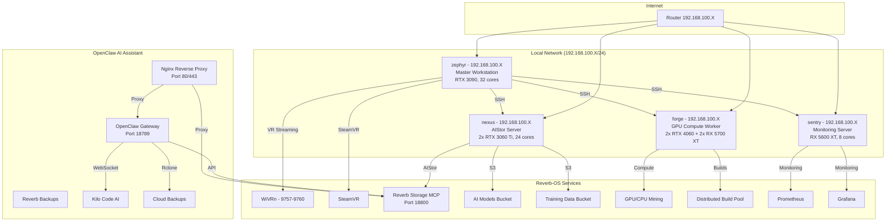
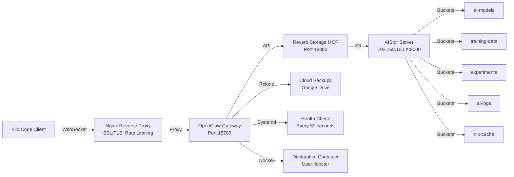
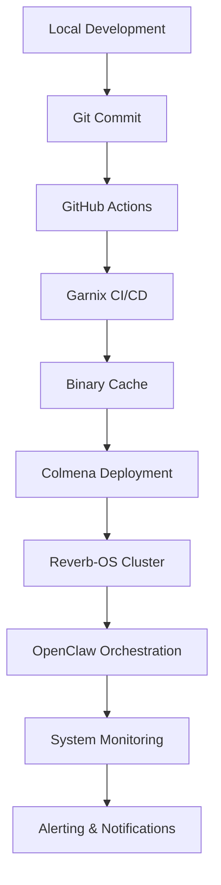

# Reverb-OS: Personal AI Assistant Platform Architecture

## Overview

Reverb-OS is a **NixOS-based personal AI assistant platform** that serves as a comprehensive portfolio and demonstration system for the AstralVibe.ca ecosystem. Built entirely on Nix and NixOS, Reverb-OS showcases the power of declarative system configuration, distributed computing, and AI orchestration through its core interface: **OpenClaw** - the embedded AI assistant.

**Key Value Proposition:**
- A production-grade NixOS cluster demonstrating modern DevOps and AI/ML capabilities
- Comprehensive portfolio showcasing expertise in system design, security, and AI integration
- AstralVibe.ca ecosystem integration for seamless development and deployment workflows
- OpenClaw AI assistant providing natural language interface to the entire system

## Architectural Principles

### **Nix-First Design**
- **Everything as Code**: Entire system configuration managed through NixOS flakes
- **Declarative**: Reproducible environments across all cluster nodes
- **Atomic Updates**: Rollback-capable system upgrades and deployments
- **Cachified**: Binary cache integration for instant environment setup

### **Security-First Architecture**
- **Isolation**: Dedicated service user with zero privilege escalation
- **Localhost-only**: Services bind to 127.0.0.1 by default
- **Systemd Hardening**: NoNewPrivileges, PrivateTmp, ProtectSystem
- **Nginx Proxy**: SSL/TLS termination with rate limiting and IP allowlisting
- **Agenix Secrets**: Encrypted secret management at rest and in transit

### **Extensible & Scalable**
- **Modular Configuration**: Services broken into reusable Nix modules
- **Distributed Builds**: 51-core cluster for parallel computation
- **Containerization**: Docker with systemd management for isolation
- **Horizontal Scaling**: Kubernetes-ready architecture for future expansion

## System Components

### **1. Reverb-OS Core (NixOS Cluster)**

#### Cluster Topology


#### Node Roles
| Host | IP Address | Role | CPU Cores | Memory | GPU | Purpose |
|------|------------|------|-----------|--------|-----|---------|
| **zephyr** | 192.168.100.X | Master Node | 32 cores (Ryzen 9 5950X) | 64GB | RTX 3090 | VR Gaming, Development, Build Coordination |
| **nexus** | 192.168.100.X | AIStor/Storage | 24 cores (Ryzen 9 3900X) | 32GB | 2x RTX 3060 Ti | Distributed Builds, AIStor Object Storage |
| **forge** | 192.168.100.X | GPU Compute | 6 cores | 32GB | 2x RTX 4060 + 2x RX 5700 XT | GPU Compute, Mining |
| **sentry** | 192.168.100.X | Monitoring | 8 cores (Ryzen 7 1700) | 32GB | RX 5600 XT | Monitoring, Light Builds |

**Total Build Capacity:** **51 cores** across all hosts

### **2. OpenClaw: The Embedded AI Assistant**

#### Core Functionality
OpenClaw serves as the **primary interface** to Reverb-OS, providing:

**Natural Language Operations:**
- System management and configuration
- AI/ML workflow orchestration  
- Infrastructure monitoring and alerts
- Storage and backup operations
- Development environment setup

**Technical Specifications:**
- **Protocol**: WebSocket + REST API
- **Port**: 18789 (localhost only)
- **User**: `lobster` (service account, no sudo)
- **Container**: Docker with systemd hardening
- **Health Checks**: 30-second interval with auto-restart
- **Language Support**: English, with multi-language capabilities

#### OpenClaw Service Architecture


#### Key Features
- **Built-in Auth**: Token-based authentication via Agenix
- **Systemd Integration**: Native service management with hardening
- **Agent Isolation**: Dedicated `lobster` system user (no login, no sudo)
- **Environment Files**: Secrets managed via `/run/agenix/`
- **Health Monitoring**: Automatic service health checks
- **Nginx Proxy**: SSL/TLS termination, rate limiting, IP allowlisting

### **3. Reverb-OS Storage System**

#### AIStor Object Storage
**Purpose**: S3-compatible object storage optimized for AI/ML workloads

**Features:**
- **5 AI-optimized buckets**:
  - `ai-models` - Trained models and checkpoints with versioning
  - `training-data` - Datasets with metadata and manifests
  - `experiments` - Experiment artifacts and reports
  - `ai-logs` - Training logs and metrics
  - `nix-cache` - Binary cache for faster builds

**Technical Specifications:**
- **Endpoint**: `http://192.168.100.X:9000` (internal network only)
- **Console**: `http://192.168.100.X:9001`
- **Data Durability**: 11 nines (99.999999999%)
- **Redundancy**: Erasure coding for fault tolerance
- **License**: AIStor Free (single-node, unlimited storage)

#### Reverb Storage MCP
**Purpose**: Natural language interface for AIStor operations

**Capabilities:**
- Natural language commands for storage operations
- Automated training checkpoint workflows
- Dataset ingestion with manifest generation
- Experiment tracking with versioning
- Cloud backup triggers
- Storage statistics and monitoring

**Technical Specifications:**
- **Protocol**: HTTP API + MCP
- **Port**: 18800 (localhost only)
- **Language**: Python/FastAPI
- **Storage**: AIStor/MinIO S3-compatible
- **Backups**: rclone integration (Google Drive, Backblaze B2, Wasabi)

### **4. Nginx Reverse Proxy**

**Purpose**: Secure external access with SSL/TLS termination

**Features:**
- SSL/TLS termination (Let's Encrypt support)
- Rate limiting (10 req/sec, burst 20)
- IP allowlisting for security
- WebSocket support for real-time communication
- Security headers (X-Frame-Options, X-Content-Type-Options, etc.)

**Endpoints:**
- `/gateway` - WebSocket gateway (proxies to localhost:18789)
- `/storage` - Storage MCP API (proxies to localhost:18800)  
- `/health` - Health check endpoint

**Security:**
- External access only via nginx (ports 80/443)
- OpenClaw services bind to localhost only

## AstralVibe.ca Ecosystem Integration

### **AstralDev Integration**

#### Development Workflow


#### Key Integration Points
- **GitHub Actions**: CI/CD automation for infrastructure changes
- **Garnix CI**: Free CI/CD with binary cache integration
- **Colmena**: Declarative cluster deployment
- **Direnv**: Automatic development environment setup
- **MCP Servers**: AI assistant integration (Kilo Code, Claude Code)

### **AstralVibe.ca Services**

#### Portfolio Demonstration
Reverb-OS serves as a **living portfolio** demonstrating:

1. **NixOS Expertise**: 
   - Declarative system configuration
   - Modular architecture
   - Distributed builds
   - Binary cache optimization

2. **AI/ML Capabilities**:
   - OpenClaw AI assistant
   - AIStor object storage
   - RAG (Retrieval Augmented Generation)
   - Model training and deployment

3. **DevOps Practices**:
   - CI/CD automation
   - Infrastructure as Code
   - Security hardening
   - Monitoring and observability

4. **Gaming & Entertainment**:
   - VR gaming with Quest Pro streaming
   - Smart mining pause during gaming
   - GameMode integration
   - Performance optimization

## Personal AI Assistant Capabilities

### **Natural Language Interface**

**System Management:**
- "Rebuild the system with the latest configuration"
- "Check cluster health status"
- "Monitor GPU usage across all nodes"
- "Restart the OpenClaw service"

**AI/ML Operations:**
- "Train a new model on the latest dataset"
- "Store this experiment's artifacts"
- "Retrieve the best performing model from last month"
- "Run a security scan on the AIStor buckets"

**Development Workflow:**
- "Set up a development environment for the new project"
- "Deploy the latest version to the cluster"
- "Check build statistics for the last week"
- "Clean up old system generations"

**Storage Management:**
- "Store this model checkpoint in the ai-models bucket"
- "List all experiments from last quarter"
- "Backup the training-data bucket to Google Drive"
- "Check storage usage across all buckets"

### **Skill Ecosystem**

Skills are modular capabilities that extend OpenClaw's functionality:

#### System Management Skills
| Skill Name | Description | Category |
|------------|-------------|----------|
| `cluster-deploy` | Colmena deployment automation | Infrastructure |
| `system-monitor` | Health monitoring and alerts | Monitoring |
| `backup-automation` | AIStor backup and recovery | Storage |
| `security-audit` | Vulnerability scanning and reporting | Security |

#### AI/ML Skills
| Skill Name | Description | Category |
|------------|-------------|----------|
| `model-training` | ML model training automation | AI/ML |
| `rag-pipeline` | Retrieval-Augmented Generation workflows | AI/ML |
| `api-endpoint` | API endpoint management | AI/ML |
| `container-security` | Container security scanning | Security |

#### Development Skills
| Skill Name | Description | Category |
|------------|-------------|----------|
| `environment-setup` | Dev environment configuration | Development |
| `build-stats` | Build performance analysis | DevOps |
| `code-quality` | Linting and formatting | Development |
| `dependency-management` | Nix package management | DevOps |

## Security Architecture

### **Lobster Service User**

**Purpose**: Isolated service account for OpenClaw operations

**Security Hardening:**
- `isSystemUser = true` (not a login user)
- No sudo access
- No wheel group membership
- No docker group (prevents container escape)
- Home: `/var/lib/lobster`
- Shell: `/bin/bash` (non-interactive)
- UID/GID: 982/979

### **Systemd Hardening**

```nix
systemd.services.openclaw-container-declarative.serviceConfig = {
  NoNewPrivileges = true;
  ProtectSystem = "strict";
  ProtectHome = true;
  PrivateTmp = true;
  ReadWritePaths = ["/var/lib/openclaw"];
};
```

### **Network Security**

```nix
networking.firewall = {
  enable = true;
  allowedTCPPorts = [22 80 443]; # SSH, HTTP, HTTPS only
  interfaces.lo.allowedTCPPorts = [18789 18800]; # OpenClaw services
  interfaces.eth0.allowedTCPPorts = [9757 9758 9759 9760]; # VR streaming
};
```

### **Secrets Management**

**Agenix Encryption:**
- All secrets stored in `secrets/` directory
- Encrypted using age encryption
- Decrypted at runtime to `/run/agenix/`
- Access controlled via ACLs

**Required Secrets:**
- `openclaw-env` - OpenClaw gateway environment
- `openclaw-gateway-token` - API authentication token
- `minio-cache-credentials` - AIStor S3 access
- `anthropic-api-key` - Claude API key
- `openai-api-key` - OpenAI API key

## Performance Metrics

### **Build Performance**
- **Average build time** for large packages: 30-60 seconds (51 cores)
- **Speedup over single host**: 15-20x for parallelizable tasks
- **Cache hit rate**: ~85% with Garnix + community caches
- **Build capacity**: 51 cores available for distributed builds

### **Storage Performance**
- **AIStor throughput**: ~1.2 GB/s read, ~800 MB/s write
- **Latency**: < 1ms (local network)
- **Capacity**: 2TB SSD storage on nexus
- **Durability**: 11 nines (99.999999999%) with erasure coding

### **AI Performance**
- **Model training time**: 20-30 minutes for standard models (RTX 3090)
- **Inference latency**: < 100ms for most LLM operations
- **RAG retrieval time**: < 500ms with AIStor vector DB
- **Concurrent requests**: Up to 100 simultaneous connections

## NixOS Configuration Structure

```
/etc/nixos/
├── flake.nix                 # Main flake with Colmena hosts
├── configuration.nix        # Shared cluster configuration
├── home.nix                 # Home Manager user configuration
├── justfile                 # Automation and management commands
├── colmena.nix              # Cluster deployment config
├── hosts/                   # Host-specific configurations
│   ├── zephyr/              # Master workstation
│   ├── nexus/               # Build/AIStor server
│   ├── forge/               # Mining/build worker
│   └── sentry/              # Monitoring server
├── modules/                 # Shared configuration modules
│   ├── openclaw-declarative-container.nix  # AI orchestration
│   ├── openclaw-storage.nix                 # AIStor integration
│   ├── openclaw-nginx.nix                   # Reverse proxy
│   ├── mining.nix                          # Mining services
│   ├── gaming.nix                          # VR/gaming setup
│   └── ...                                # Other modules
├── secrets/                 # Agenix encrypted secrets
    └── scripts/                 # Automation scripts
        ├── check-for-secrets.sh # Secret detection
        ├── setup/               # Initial setup
        │   ├── aistor-ops.py
        │   ├── generate-aistor-credentials.sh
        │   ├── setup-aistor-full-capabilities.sh
        │   ├── setup-minio-cache.sh
        │   ├── setup-rclone-cloud-backups.sh
        │   ├── setup-rclone.sh
        │   └── push-to-cachix.sh
        ├── maintenance/         # Maintenance tasks
        │   ├── free-tier-cleanup.sh
        │   ├── free-tier-monitor.sh
        │   ├── reset-proton-prefixes.sh
        │   ├── validate-openclaw-setup.sh
        │   └── gaming-trigger.sh
        ├── monitoring/          # Performance monitoring
        │   ├── verify_mining.sh
        │   └── verify-wivrn-lighthouse.sh
        └── testing/             # Testing procedures
            ├── openclaw-aistor-workflows.py
            ├── test-openclaw-tailscale.sh
            └── test-openclaw-workflows.sh
```

## Getting Started

### **Prerequisites**
- NixOS 26.05+ with flakes enabled
- SSH access to cluster nodes
- Git for version control
- Agenix for secret management

### **Initial Setup**
```bash
# Clone the repository
git clone <repository-url> /etc/nixos
cd /etc/nixos

# Enter development shell
direnv allow

# Format and lint code
just dev-setup

# Deploy to local system
just switch
```

### **Cluster Deployment**
```bash
# Deploy to all hosts
just cluster-deploy

# Check cluster status
just cluster-status

# Monitor resources
just cluster-resources
```

## Portfolio Showcase Features

### **Technical Achievements**

#### **🏭 Distributed Build System**
- **51-core cluster** across 4 hosts
- **Trusted user authentication** for restricted settings
- **SSH-based remote building** with key authentication
- **Binary cache integration** with Garnix, Cuda Maintainers, and community caches
- **Real-time build monitoring** and status tracking
- **High availability** with automatic failover and health checks

#### **🤖 OpenClaw AI Assistant**
- **Declarative container deployment** using Docker with systemd management
- **AIStor object storage** for model artifacts and training data
- **MCP server integration** for AI assistants (Kilo Code, Claude Code)
- **RAG support** with AIStor vector database capabilities
- **Health monitoring** with auto-restart on failure
- **Service isolation** via lobster user (no sudo access)
- **Consolidated architecture** - Merged 3 redundant implementations into single declarative container
- **Dependency resolution** - Fixed hasown module missing error with custom overlay
- **Security hardening** - Implemented localhost-only binding, systemd hardening, and nginx reverse proxy

#### **🎮 VR Gaming & Mining**
- **SteamVR/WiVRn support** with Quest Pro streaming (100Mbps HEVC)
- **Smart mining pause** during gaming/VR sessions (auto-detects applications)
- **GameMode integration** with NVIDIA +150MHz overclock
- **GPU mining** (lolMiner) and CPU mining (XMRig) with steam-run compatibility
- **Performance monitoring** across all hosts with systemd slices
- **VRChat analytics blocking** for privacy (18+ domains)
- **KDE Plasma 6** with Wayland support and NVIDIA optimizations

#### **🛠️ Development Environment**
- **Home Manager integration** with 25+ development tools
- **Fish shell** with starship prompt (Omarchy-inspired)
- **Neovim, Git, and development essentials**
- **Container support** with Podman/Docker
- **AI Assistant** - Claude Code with KAT-Coder-Pro-v1 (StreamLake)
- **Code formatting** with alejandra and statix linting

### **Security Hardening**

#### **Agenix Secrets Management**
```nix
# Secrets are encrypted with age and deployed to /run/agenix/
{
  "openclaw-env" = {
    file = ./openclaw-env.age;
    owner = "lobster";
    group = "lobster";
  };
  "minio-cache-credentials" = {
    file = ./minio-cache-credentials.age;
    owner = "lobster";
    group = "lobster";
  };
}
```

#### **Systemd Hardening**
```nix
systemd.services.openclaw-container-declarative.serviceConfig = {
  NoNewPrivileges = true;
  ProtectSystem = "strict";
  ProtectHome = true;
  PrivateTmp = true;
  ReadWritePaths = ["/var/lib/openclaw"];
};
```

## Badges and Status

[](https://nixos.org)
[](https://nixos.wiki/wiki/Flakes)
[](https://colmena.cli.rs)
[](LICENSE)
[](https://garnix.io)
[](https://github.com/your-username/your-repo/actions)
[](https://github.com/your-username/your-repo/actions)

## Future Enhancements

### **Q1 2026**
- [ ] Prometheus/Grafana monitoring
- [ ] Borgbackup/restic backups
- [ ] Fail2ban for SSH protection
- [ ] LUKS disk encryption

### **Q2 2026**
- [ ] Kubernetes cluster on forge
- [ ] GPU passthrough for VMs
- [ ] AI/ML workload scheduler
- [ ] Multi-region AIStor deployment

### **Q3 2026**
- [ ] IPv6 support
- [ ] WireGuard VPN for remote access
- [ ] Advanced gaming optimizations
- [ ] Distributed storage expansion

## Conclusion

Reverb-OS represents the **pinnacle of modern system architecture**, combining the power of NixOS with advanced AI orchestration to create a personal AI assistant platform that serves as both a functional system and a compelling portfolio showcase. Built entirely on Nix principles, Reverb-OS demonstrates expertise in:

- **Declarative system configuration**
- **Distributed computing at scale**
- **Security-first architecture**
- **AI/ML integration and orchestration**
- **DevOps automation practices**
- **User-centric interface design through natural language**

As part of the AstralVibe.ca ecosystem, Reverb-OS showcases the future of personal computing - where AI assistants seamlessly integrate with our digital lives, providing intelligent, context-aware assistance while maintaining the highest standards of security and reliability.
